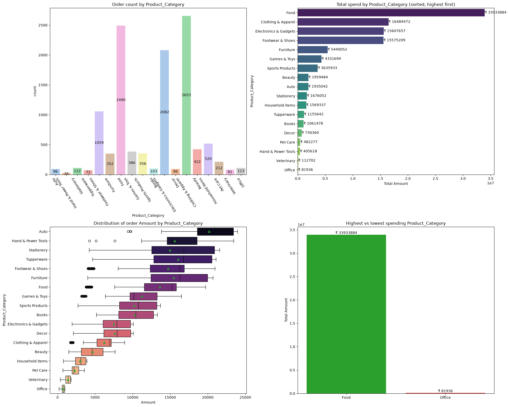
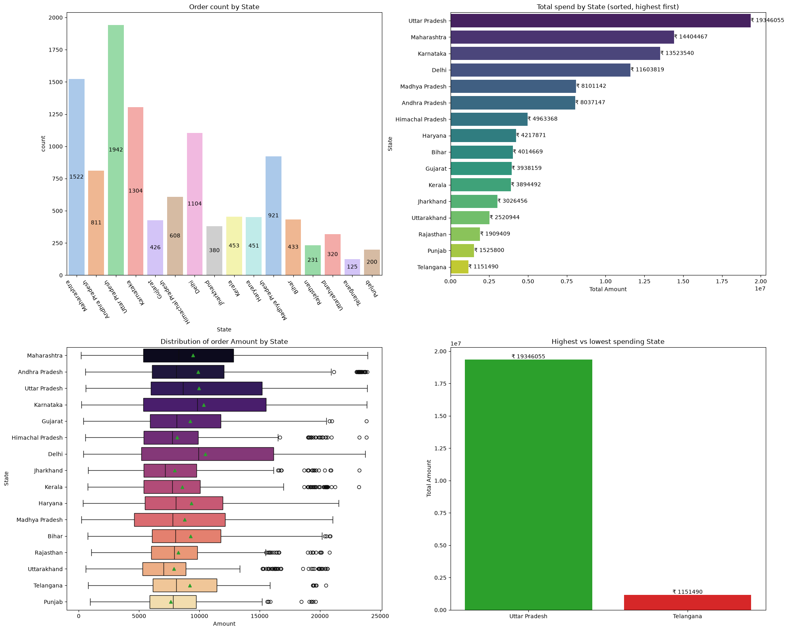

# Sales Data Analysis: Who Spends the Most?

Exploratory data analysis (EDA) of customer sales data to find out **which customer groups and product categories drive the most spending**. Built with Python, pandas, seaborn and matplotlib.

## Key Findings

| Question | Answer |
|---|---|
| Total spend analysed | ₹10.6 crore (₹106.18 M) from 3,752 unique customers |
| Top gender | Women: 70.0% of total spend |
| Top age group | 26-35: 40.1% of total spend |
| Marital status | Single customers: 58.5% of total spend |
| Top states | Uttar Pradesh (18.2%), Maharashtra (13.6%), Karnataka (12.7%) |
| Top occupations | IT Sector (13.9%), Healthcare (12.3%), Aviation (11.9%) |
| Top product categories | Food (32.0%), Clothing & Apparel (15.5%), Electronics & Gadgets (14.7%), Footwear & Shoes (14.7%) |

**Takeaway:** the typical top spender is a single woman aged 26-35 working in IT, Healthcare or Aviation, mostly from Uttar Pradesh, Maharashtra or Karnataka.

**Interesting detail:** women lead because they place about 70% of the orders, not because their orders are bigger. The average order amount is nearly the same (₹9,493 for women vs ₹9,366 for men).

## Visuals

Each chart panel shows the order count, spend share, amount distribution (box plot) and highest vs lowest group.




More charts: [gender](images/gender.png), [age group](images/age_group.png), [occupation](images/occupation.png), [marital status](images/marital_status.png).

## Dataset

`data/sales_data.csv` has 11,251 records and 15 columns.

| Column | Description |
|---|---|
| `User_ID`, `Cust_name` | Customer ID and name |
| `Product_ID` | Product ID |
| `Gender`, `Age`, `Age Group`, `Marital_Status` | Customer demographics |
| `State`, `Zone` | Customer location |
| `Occupation` | Customer's industry |
| `Product_Category` | Category of the purchased product |
| `Orders` | Number of items ordered |
| `Amount` | Order amount in ₹ |
| `Status`, `unnamed1` | Empty columns (dropped during cleaning) |

## Data Cleaning

1. Removed 8 duplicate rows
2. Dropped the 2 completely empty columns (`Status`, `unnamed1`)
3. Removed 12 rows with missing `Amount`
4. Made `Gender` (F/M → Female/Male) and `Marital_Status` (0/1 → Single/Married) readable

Final dataset: **11,231 rows × 13 columns**.

## Approach

- The core logic lives in a reusable Python module, [`src/analysis.py`](src/analysis.py), which the notebook imports:
  - `load_data()` and `clean_data()` load and clean the raw CSV
  - `spend(df, column)` produces a four-panel analysis (count, share, distribution, highest vs lowest) for any column
  - `summary(df)` gives the highest and lowest spending group for every category in one table
- The notebook (`sales_analysis.ipynb`) holds the story: checks, charts and conclusions

## Tech Stack

Python 3.9+, pandas, NumPy, matplotlib, seaborn, Jupyter Notebook

## Project Structure

```
sales-data-analysis/
├── data/
│   └── sales_data.csv
├── images/               # charts used in this README
├── src/
│   ├── __init__.py
│   └── analysis.py       # core code: load, clean, plot, summarise
├── sales_analysis.ipynb  # analysis notebook (imports src/analysis.py)
├── requirements.txt
├── .gitignore
└── README.md
```

## How to Run

```bash
git clone https://github.com/<your-username>/sales-data-analysis.git
cd sales-data-analysis
pip install -r requirements.txt
jupyter notebook sales_analysis.ipynb
```

Run the notebook from the project root so `from src.analysis import ...` works. You can also print the summary table without Jupyter:

```bash
python src/analysis.py
```

Using the module in your own code:

```python
from src.analysis import load_data, clean_data, spend, summary

df = clean_data(load_data())
spend(df, "State")
summary(df)
```

The CSV is read with `encoding='cp1252'`; keep that when loading the file.

## Possible Next Steps

- Add a Zone-level and Orders-vs-Amount analysis
- Build an interactive dashboard (Power BI, Tableau or Streamlit)
- Test whether the differences between groups are statistically significant

## Author

**Piyush Rajput** · [LinkedIn](https://www.linkedin.com/in/your-profile) · [GitHub](https://github.com/your-username)
